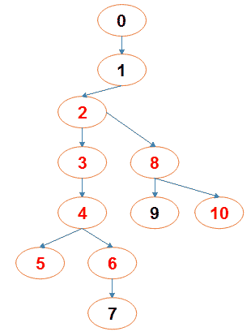

Find Minimum Billable Training Count
As the demand for knowing Japanese language is increasing in Software Services industry (due to increase in projects from Japan), a software company decides to teach Japanese to N employees. An expert in Japanese language is hired and is designated as the ROOT mentor. Under the ROOT mentor, there are certain employees who belong to level1. Under each of these level1 employees, certain number of employees are assigned and they belong to level2. This process is repeated till all the N employees are accounted for.

So the structure is like a ROOT mentor will have level1 mentees. These level1 mentees can inturn mentor level2 mentees. The level2 mentees can inturn mentor level3 mentees and so on.

But certain employees among these N employees are already fluent in Japanese and they do not need training. Also there is a special offer that if a specific employee is trained (and billed), his immediate mentor and his immediate mentees can attend the training free of cost. So the program  must find and print the minimum biilable training count so that all the employees who are not fluent in Japanese can be trained using this special offer.

Note: Always the ROOT mentor is fluent in Japanese. But if need arises to make the training count minimum he can be considered as a billable training employee. The employee id of the ROOT mentor is 0. The employee id of the other employee is from 1 to N-1

Input Format:
First line contains N.
Next N-1 lines contain two integer values separated by a space- 1)employee id of the mentor and 2) 1 or 0 indicating if the employee is fluent in Japanese or not.

Output Format:
First line contains the minimum billable training count

Boundary Conditions:
1 <= N <= 100000

Example Input/Output 1:
Input:
11
0 1
1 0
2 0
3 0
4 0
4 0
6 1
2 0
8 1
8 0

Output:
2

Explanation:

The red colored employee ids are those who do not know Japanese.
So when we train Employee 4, using the special offer 3,5,6 get free training.
When we train Employee 8, using the special offer 2 and 10 get free training.
Now all the employees who do not know Japanese are accounted for the training.
So the minimum billable training count is 2.

 

<pre>
#include &lt;bits/stdc++.h>
 
using namespace std;
int ans=0;
vector&lt;int> know;
void print(vector&lt;vector&lt;int>>& mat){
    int ctr=0;
    for(auto i : mat) {
        cout << ctr << " " << know[ctr] << " => ";
        ctr++;
        for(auto j :i){
            cout << j << " ";
        }
        cout << endl;
    }
    cout << endl;
    cout << ans<< endl;
}
void g(vector&lt;vector&lt;int>>& root, int par, int curr){
    
    int ctr=0;
    
    for(int nei : root[curr]){
        g(root, curr, nei);
        if(!know[nei]){
            ctr++;
        }
        know[nei] =1;
    }
    
    if(ctr){
        ans++;
            know[curr]=know[par]=1;
    }
}
int main(int argc, char** argv)
{
    int N; cin >> N;
    vector&lt;vector&lt;int>> root(N);
    know.resize(N,0);
    
    for(int i=1; i&lt;N; i++){
        int V; cin >> V >> know[i];
        root[V].push_back(i);
    }
    know[0] =1;
    int ctr=0;
    for(int nei : root[0]){
        g(root,0, nei);
        
        if(!know[nei]){
            ctr++;
        }
        
        know[nei]=1;
    }
    
    if(ctr) ans++;
    cout <&lt;ans;
}
</pre>

 
<pre>
import java.util.*;

class Employee implements Comparable&lt;Employee> {
    private int id;
    private Set&lt;Employee> mentees;
    private Employee mentor;
    private boolean isFluent;
    
    public Employee(int id) {
        mentees = new HashSet<>();
        this.id = id;
        mentor = null;
        isFluent = false;
    }
    
    public void addMentees(Employee pupil) {
        mentees.add(pupil);
    }
    
    public void setMentor(Employee mentor) {
        this.mentor = mentor;
    }
    
    public Employee getMentor() {
        return mentor;
    }
    
    public boolean isFluent() {
        return isFluent;
    }
    
    public void setFluent(boolean fluent) {
        isFluent = fluent;
    }
    
    public Set<Employee> getMentees() {
        return mentees;
    }
    
    public int getId() {
        return id;
    }
    
    public void completeTraining() {
        isFluent = true;
        for (Employee e: mentees) {
            e.isFluent = true;
        }
        mentees.clear();
    }
    
    public int getNonFluentCount() {
        return (int) mentees.stream().filter(e->!e.isFluent).count();
    }
    
    @Override
    public int compareTo(Employee o) {
        if (o.isFluent) {
            return -1;
        }
        if (isFluent) {
            return 1;
        }
        int cur = getNonFluentCount();
        int other = o.getNonFluentCount();
        if (mentor != null) {
            cur++;
        }
        if (o.mentor != null) {
            other++;
        }
        int val = Integer.compare(other, cur);
        return val;
    }
}

public class Hello {

    public static void main(String[] args) {
		//Your Code Here
		Scanner sc = new Scanner(System.in);
		int n = sc.nextInt();
		int counter = 1;
		Employee[] employees = new Employee[n];
		for (int i = 0; i < n; i++) {
		    employees[i] = new Employee(i);
		}
		employees[0].setFluent(true);
		for (int i = 1; i < n; i++) {
		    int a = sc.nextInt();
		    int b = sc.nextInt();
		    if (b == 0) {
		        employees[a].addMentees(employees[i]);
		    } else {
		        employees[i].setFluent(true);
		    }
		    if (!employees[a].isFluent()) {
		        employees[i].setMentor(employees[a]);
		    }
		}
		int offers = 0;
		for (int i = n - 1; i >= 0; i--) {
		    Employee cur = employees[i];
		    if (cur.getNonFluentCount() > 0) {
		        offers++;
		        cur.completeTraining();
		        if (cur.getMentor() != null) {
		            cur.getMentor().setFluent(true);
		        }
		    }
		}
		System.out.println(offers);

	}
}
</pre>

 
<pre>
#include &lt;bits/stdc++.h>
 
using namespace std;

vector&lt;int> vis(100001,0);
vector&lt;int> lang(100001,0);
vector&lt;int> adj[100001];
int counter[100001]={0};
int mentor[100001];
int ans=0;

void dfs(int src){
    int flag=0;
    for(auto& it: adj[src]){
        if(vis[it]==0 && lang[it]==0){
            vis[src]=1;
            vis[it]=1;
            vis[mentor[src]]=1;
            flag=1;
        }
    }
    if(flag){
        ans++;
    }
}

int main(int argc, char** argv)
{//printf("->\n");
int n,u,v;
cin>>n;
lang[0]=0;
for(int i=1;i&lt;n;i++){
    cin>>u>>v;
    adj[u].push_back(i);
    mentor[i]=u;
    lang[i]=v;
}
for(int i=n-1;i>=0;i--){
    dfs(i);
}
cout&lt;&lt;ans&lt;&lt;endl;
}
</pre>