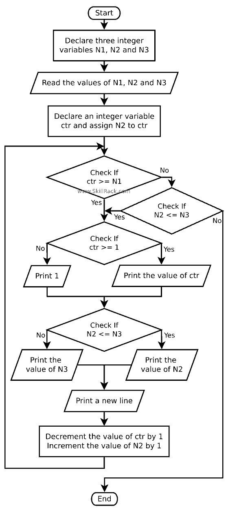

<pre>
a,b,c=map(int,input().split())
ctr=b
while True:
    if ctr>=a or b<=c:
        if ctr>=1:
            print(ctr,end=' ')
        else:
            print(0,end=' ')
        if b<=c:
            print(b)
        else:
            print(c)
        ctr-=1
        b+=1
    else:
        break
</pre>