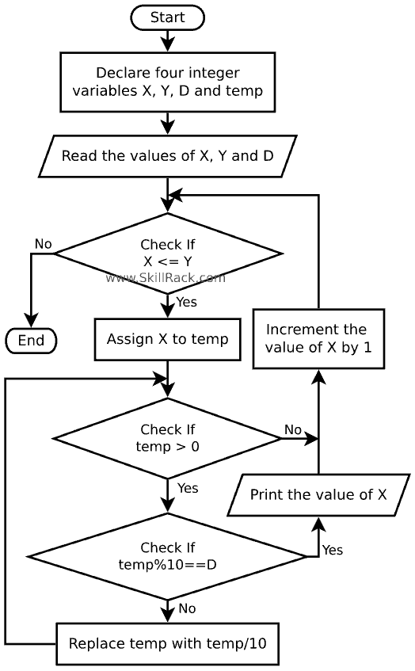

<pre>
x,y,d = map(int,input().split())
while x&lt;=y:
    temp = x 
    while temp &gt; 0:
        if temp%10 == d:
            print(x,end=' ')
            break
        else:
            temp//=10
    x+=1
</pre>