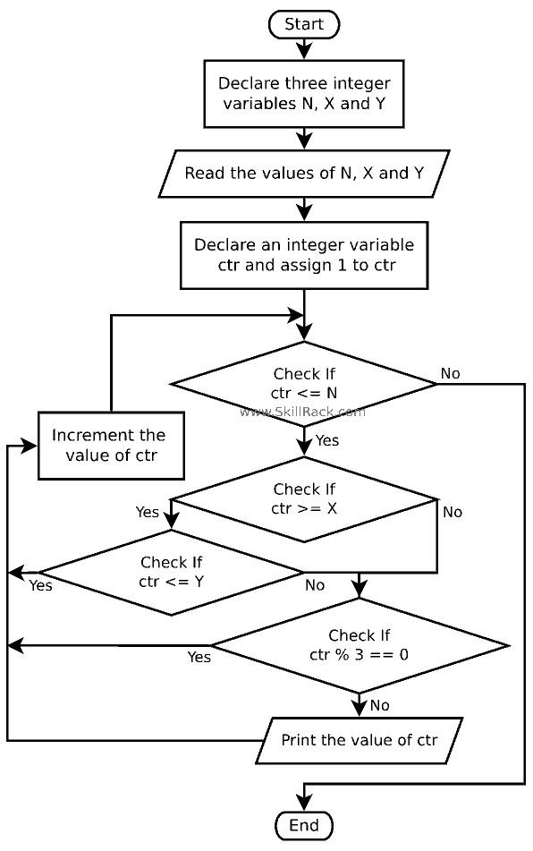

<pre>
#include&lt;stdio.h&gt;
#include&lt;stdlib.h&gt;

int main()
{
    int n,x,y,ctr = 1;
    scanf("%d %d %d",&n,&x,&y);
    while(ctr&lt;=n){
        if(ctr&gt;=x){
            if(ctr&lt;=y) ctr = ctr;
            else{
                if(ctr%3!=0){
                    printf("%d ",ctr);
                }
            }
        }else{
            if(ctr%3!=0){
                printf("%d ",ctr);
            }
        }
        ctr++;
    }
}
</pre>

<pre>
n, x, y = map(int,input().split())
ctr = 1
while ctr&lt;=n:
    if ctr &gt;= x:
        if ctr &lt;= y:
            pass
        else:
            if ctr % 3 !=0:
                print(ctr,'1')
    else:
        if ctr % 3 ==0:
            pass
        else:
            print(ctr,'2')
    ctr+=1
</pre>