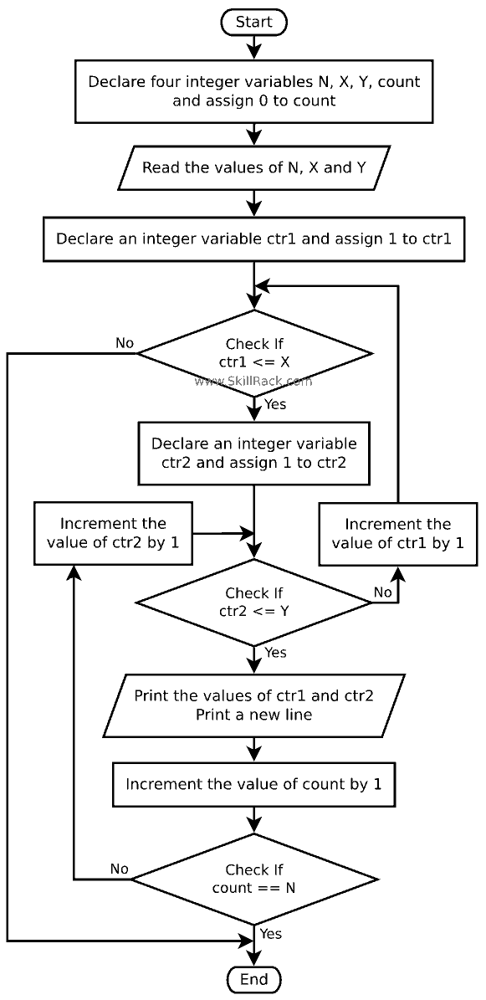

 
<pre>
count = 0
n,x,y = map(int,input().split())
ctr1 = 1 
while ctr1&lt;=x: 
    ctr2 = 1 
    while ctr2 &lt;= y: 
        print(ctr1,ctr2)
        count+=1 
        if count==n: exit()
        ctr2+=1 
    ctr1+=1 
</pre>